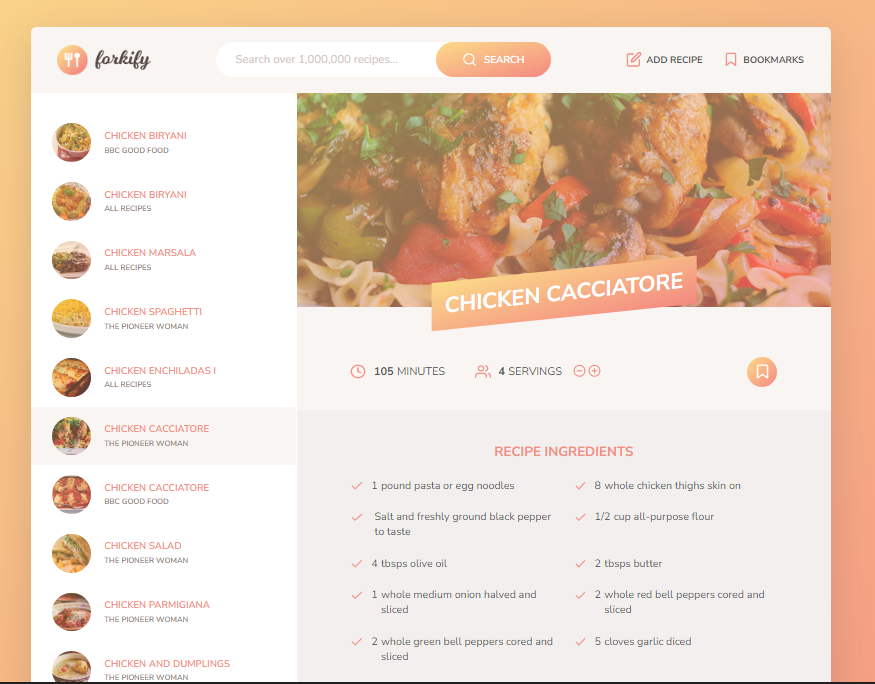

# Forkify 

Forkify is a project created as part of an Advanced JavaScript course on [Udemy](https://www.udemy.com/course/the-complete-javascript-course/) by instructor Jonas Schmedtmann. It is a recipe app built using the Model-View-Controller (MVC) architecture in JavaScript. It allows users to search for and bookmark recipes from a database of over 1 million recipes.

<h1 align="center">
    
</h1>

## Features

- Search for recipes by entering a query
- View recipe details including ingredients, instructions, and images 
- Adjust the number of servings to scale the recipe 
- Bookmark your favorite recipes to view them later
- Upload your own recipes to the database

## Tech Stack

- JavaScript (ES6+)
- Forkify API for recipe data 
- MVC architecture
- Async/Await for asynchronous functions
- LocalStorage for bookmarking recipes

## Possible Improvements

- Add nutrition information for recipes 
- Improve search to better match user intent 
- Add user accounts to save bookmarks 
- Allow users to upload images for their recipes
- Add filtering and sorting options for search

## Instructions

1. Clone the repo ``` git clone https://github.com/hariyebk/forkify.git ```
2. Run `npm install` to install dependencies
3. Run `npm start` to start the development server
4. Open `http://localhost:1234` in your browser

## Contributing 

Contributions are welcome and encouraged! To contribute please follow these steps:

1. Fork this repository by clicking on "Fork" button at right top corner of page.
2. Create new branch: `git checkout -b my-new-feature`
3. Make changes to files according to desired feature(s).
4. Commit your changes: `git commit -am 'Add some feature'`.
5. Push to the branch: `git push origin my-new-feature`.
6. Submit a pull request by opening PR in original respository (not yours)

I review all pull requests thoroughly and appreciate every contribution made.


If you find any bugs/issues/errors please create an issue ticket/appropriate category within issues in Github.


## License

This project is licensed under MIT license - see LICENSE.md for more details.

## Project Status

This project was built as part of Jonas Schmedtmann's JavaScript course on Udemy. I may continue to improve and add new features to the project over time.
